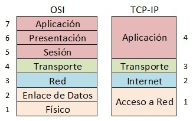

# Modelos de Red TCP/IP y OSI

## 1. Modelo TCP/IP

### 1.1 Características Principales
- Modelo práctico y ampliamente implementado
- Desarrollado por el Departamento de Defensa de EE.UU.
- Base fundamental de Internet
- Consta de 4 capas

### 1.2 Capas del Modelo TCP/IP
1. **Capa de Acceso a Red**
   - Especifica forma física de transmisión de datos
   - Incluye protocolos como Ethernet, WiFi
   - Maneja direccionamiento físico (MAC)

2. **Capa de Internet**
   - Permite que los hosts inyecten paquetes en la red
   - Gestiona el direccionamiento IP
   - Principales protocolos: IP, ICMP, ARP

3. **Capa de Transporte**
   - Proporciona comunicación extremo a extremo
   - Protocolos principales:
     - TCP (orientado a conexión, fiable)
     - UDP (sin conexión, no fiable)

4. **Capa de Aplicación**
   - Contiene protocolos de alto nivel
   - Ejemplos: HTTP, FTP, SMTP, DNS

## 2. Modelo OSI

### 2.1 Características Principales
- Modelo teórico de referencia
- Desarrollado por ISO
- Consta de 7 capas
- Base para entender comunicaciones de red

### 2.2 Capas del Modelo OSI
1. **Física**
   - Transmisión de bits puros
   - Características eléctricas y físicas

2. **Enlace de Datos**
   - Control de acceso al medio
   - Detección de errores
   
3. **Red**
   - Enrutamiento
   - Direccionamiento lógico

4. **Transporte**
   - Control de flujo
   - Segmentación
   
5. **Sesión**
   - Control de diálogos
   - Sincronización

6. **Presentación**
   - Formato de datos
   - Encriptación

7. **Aplicación**
   - Servicios de red a aplicaciones

## 3. Protocolos TCP/IP Principales

### 3.1 Protocolos de Aplicación
- **HTTP**: Transferencia de hipertexto
- **FTP**: Transferencia de archivos
- **SMTP**: Correo electrónico
- **DNS**: Sistema de nombres de dominio
- **SSH**: Conexión segura
- **Telnet**: Conexión remota

### 3.2 Protocolos de Transporte
#### TCP (Transmission Control Protocol)
- Orientado a conexión
- Garantiza entrega de datos
- Control de flujo
- Segmentación de datos
- Numeración y reordenación

#### UDP (User Datagram Protocol)
- No orientado a conexión
- No garantiza entrega
- Más rápido que TCP
- Útil para streaming y tiempo real

### 3.3 Protocolos de Internet
#### IP (Internet Protocol)
- Direccionamiento lógico
- Enrutamiento de paquetes
- Versiones: IPv4 e IPv6

#### ICMP
- Control y notificación de errores
- Usado por ping y traceroute

#### ARP
- Resolución de direcciones IP a MAC
- Fundamental en redes locales

## 4. Comparativa TCP/IP vs OSI

### 4.1 Ventajas TCP/IP
- Modelo práctico y probado
- Estándar de facto en Internet
- Independiente del fabricante
- Amplio soporte

### 4.2 Ventajas OSI
- Modelo más detallado
- Mejor para enseñanza
- Clara separación de funciones
- Base teórica sólida

## 5. Puntos Clave para Oposiciones
1. Saber diferenciar las capas de ambos modelos
2. Conocer los principales protocolos de cada capa
3. Entender la correspondencia entre modelos
4. Dominar características de TCP vs UDP
5. Comprender el funcionamiento básico de IP

## 6. Preguntas Frecuentes
1. ¿Por qué TCP/IP tiene menos capas que OSI?
   - TCP/IP es más práctico y agrupa funcionalidades

2. ¿Qué protocolos son fundamentales en Internet?
   - TCP/IP, HTTP, DNS son esenciales

3. ¿Cuándo usar TCP vs UDP?
   - TCP: datos importantes que requieren fiabilidad
   - UDP: streaming, juegos, tiempo real
