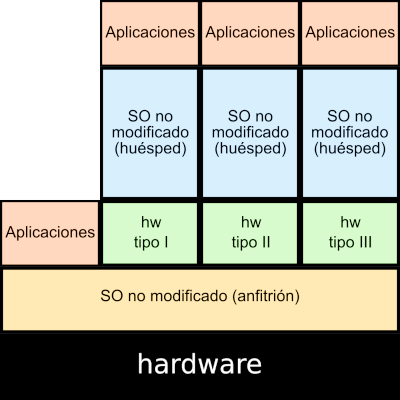
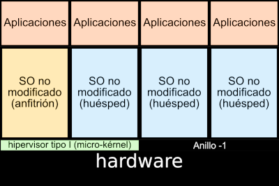
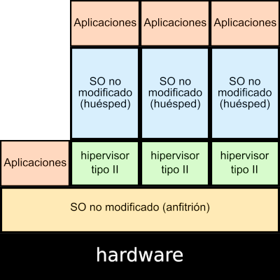
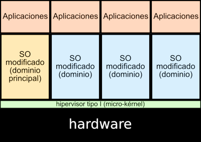
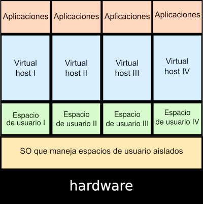

# Tipos de virtualización

En el punto anterior aprendimos que un **Hipervisor** es el software que nos permite realizar la virtualización. Según como funcione el Hipervisor podemos clasificar distintas técnicas de virtualización:

## Emulación

El hipervisor imita o suplanta vía software una arquitectura al completo (procesador, memoria, conjunto de instrucciones, comunicaciones...). De esta forma puede hacer creer a los programas y sistemas operativos diseñados para una arquitectura concreta que son ejecutados sobre ella. La emulación suele ofrecer un rendimiento bastante bajo debido a que hay que realizar un proceso completo de traducción. Ejemplo: QEMU, Microsoft Virtual PC, Wine, ...

## Virtualización completa o por hardware

El hipervisor simula un hardware suficiente para permitir que un sistema operativo no adaptado se ejecute de forma aislada. En este caso podemos hacer una subdivisión según el tipo de hipervisor que estemos utilizando:

* **Virtualización por hardware**: En este caso usamos **hipervisores de tipo 1**, que controlan directamente el hardware físico del host ofreciéndolo directamente a la máquina virtual. Es imprescindible que la CPU del host tenga las extensiones de virtualización. Ejemplos: Xen, Kernel-based Virtual Machine (KVM), Microsoft Hyper-V, VMware ESXi,...

    

* **Virtualización completa**: En este tipo se usan **hipervisores de tipo 2**. Este software se instala sobre el sistema operativo del host, pero no controla directamente el hardware físico. Ofrecen menos rendimiento que la virtualización por hardware. Ejemplos: VMware Workstation, Parallels Desktop, VirtualBox, VMware Player, ...

    

## Virtualización parcial o paravirtualización

El hipervisor ofrece un interfaz especial para acceder a los recursos. En ocasiones, es necesario la adaptación del sistema operativo de la máquina virtual. Ofrecen el máximo rendimiento, pero no se pueden usar sistemas operativos sin modificaciones o hardware especifico. Ejemplos: XEN, Microsoft Hyper-V, VMware ESXi, ...

## Virtualización ligera

O también llamada **virtualización a nivel de sistema operativo**, o **virtualización basada en contenedores**. Es un método de virtualización en el que, sobre el núcleo del sistema operativo se ejecuta una capa de virtualización que permite que existan múltiples instancias aisladas de espacios de usuario. A cada espacio de usuario aislado lo llamamos **contenedor**. Por lo tanto, un contenedor es un conjunto de procesos aislados, que se ejecutan en un servidor, y que acceden a un sistema de ficheros propio, tienen una configuración red propio y accede a los recursos del host (memoria y CPU).
Podemos hacer la siguiente clasificación de contenedores:

* **Contenedores de Sistemas**: El uso que se hace de ellos es muy similar al que hacemos sobre una máquina virtual: se accede a ellos (normalmente por ssh), se instalan servicios, se actualizan, ejecutan un conjunto de procesos, ... Ejemplo: LXC(Linux Container).
* **Contenedores de Aplicación**: Se suelen usar para el despliegue de aplicaciones web Ejemplo: Docker, Podman, ...

